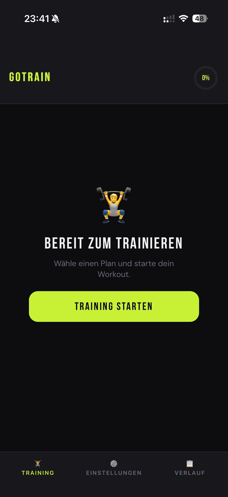
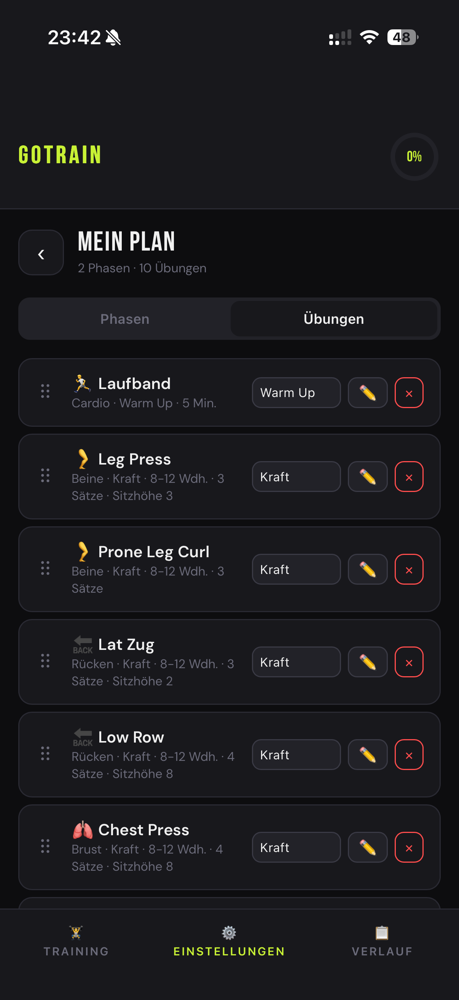
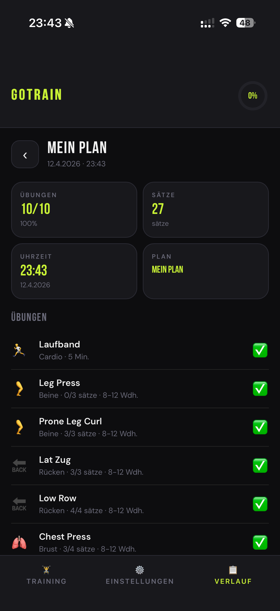
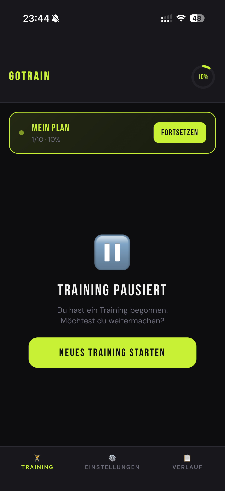

# 🏋️ GoTrain

A workout tracker that runs entirely in your browser. No account, no server, no
tracking, no third-party requests — your training data never leaves your device
unless you choose to move it.

**[Try the demo →](https://niclick.org/GoTrain)** · Free software (GPL-3.0-or-later)

| | | | |
|---|---|---|---|
|  |  |  |  |

## Features

- **Training plans** — create, copy, rename and delete as many as you like
- **Phases** — group exercises into colour-coded blocks (Warm Up, Strength, Cool Down…)
- **Exercise library** — define exercises once with a muscle group and reuse them
- **Reps or time** — sets and reps, or a countdown for timed exercises
- **Live tracking** — tick off sets, rest timer between sets, stopwatch per set
- **History** — every finished session is saved with its full exercise detail
- **Progress** — the weight you set per exercise is kept with each session, so
  your load over time is recorded, not just that you turned up
- **Send to PC** — hand your data to a desktop over the local network, either
  through the share sheet or by scanning a pairing code
- **Export / import** — a plain `.json` file you own
- **English & German** — switch in Settings
- **Works offline** — everything is cached on first visit, including the fonts
- **Installable** — add it to your home screen and it runs fullscreen

## Install on your phone

**iPhone (Safari):** open the site → Share → **Add to Home Screen**.

**Android (Chrome):** open the site → menu → **Install app**.

It then launches fullscreen with no browser chrome, and works with no
connection.

> On iOS, a home-screen app and Safari keep **separate** storage. If you install
> to the home screen, use that copy — the same site opened in Safari has its own,
> independent data.

## Hosting it yourself

GoTrain is a handful of static files. There is no build step, no package
manager, no server-side code and no database — any web server or static host
will do.

### 1. Get the files

```bash
git clone https://github.com/nicklyk/GoTrain.git
```

Everything must stay in the same directory, and all paths are relative, so a
subdirectory (`example.com/gotrain/`) works exactly as well as a domain root.

| File | Purpose |
|---|---|
| `index.html` | The whole app — markup, styles and logic in one file |
| `sw.js` | Service worker; caches the app for offline use |
| `manifest.json` | Makes it installable as an app |
| `icon-192.png`, `icon-512.png` | App icons |
| `fonts/` | Self-hosted webfonts (see *Privacy*) |
| `screenshot-*.png` | Shown in the install prompt on Android |

### 2. Serve it over HTTPS

**This is the one hard requirement.** Service workers, home-screen install and
the camera used by the QR pairing all need a *secure context*. Over plain HTTP
the app still loads, but it will not work offline, cannot be installed, and
cannot scan a pairing code.

`http://localhost` is exempt, which is why local testing works without a
certificate:

```bash
cd GoTrain
python3 -m http.server 8000
# open http://localhost:8000
```

### 3. Pick a host

**GitHub Pages** (free, HTTPS included):

1. Push the files to a repository
2. **Settings → Pages → Source: Deploy from a branch**, pick `main` and `/ (root)`
3. Your copy appears at `https://<user>.github.io/<repo>/` within a minute

**Any other web server** — copy the directory into the document root. Nothing
needs configuring; there is no runtime, no environment and nothing to
provision. One optional nicety is to serve `sw.js` with
`Cache-Control: no-cache` so updates are noticed promptly.

### 4. Publishing changes

The service worker serves the app from cache first, so **bump `CACHE_NAME` in
`sw.js`** whenever you change `index.html`. Without that, returning visitors
keep the old version indefinitely.

Even with the bump, an installed app usually shows the new version on the
*second* launch: the first one installs the new worker, the next one serves the
new page.

## Your data

Everything lives in your browser's `localStorage`, under the origin you loaded
the app from. It is never uploaded — there is nowhere to upload it *to*.

That has two consequences worth understanding:

- **Clearing site data deletes your history.** Use **Settings → Data → Export**
  to keep a backup, and **Import** to restore it.
- **Hosting a copy gives you no access to anyone's data**, including your own on
  another device. Each origin, browser and device is a separate store.

## Privacy

The app makes **no third-party requests at all** — no analytics, no CDN, no
fonts fetched from elsewhere. Load it once and you can put your phone in
aeroplane mode forever.

The webfonts are bundled in `fonts/` rather than loaded from Google Fonts. That
keeps the app self-contained and offline on first load, and avoids handing every
visitor's IP address to a third party — which the Munich Regional Court found
to be a GDPR violation (LG München I, judgment of 20 January 2022, case
3 O 17493/20).

## Desktop companion

[**omarchy-gotrain**](https://github.com/nicklyk/omarchy-gotrain) brings your
workouts onto an [Omarchy](https://omarchy.org) desktop: a bar widget, recent
sessions, strength progression and a local archive that outlives any phone
reset. It is optional — GoTrain is complete on its own.

## Development

Open `index.html` in a browser. That is the entire toolchain.

It is deliberately one file of plain HTML, CSS and JavaScript with no framework
and no build step, so it stays readable and will still run in ten years. The
only bundled dependency is a QR decoder, inlined so the app keeps working
offline.

## Licence

GPL-3.0-or-later — see [LICENSE](LICENSE).

GoTrain is free software: you may use, study, change and share it, and anyone
you give a modified copy to gets those same freedoms.

Bundled third-party components, under their own licences:

| Component | Licence |
|---|---|
| [jsQR](https://github.com/cozmo/jsQR) (inlined in `index.html`) | Apache-2.0 |
| Bebas Neue, DM Sans (`fonts/`) | SIL Open Font License 1.1 — see [`fonts/OFL.txt`](fonts/OFL.txt) |
